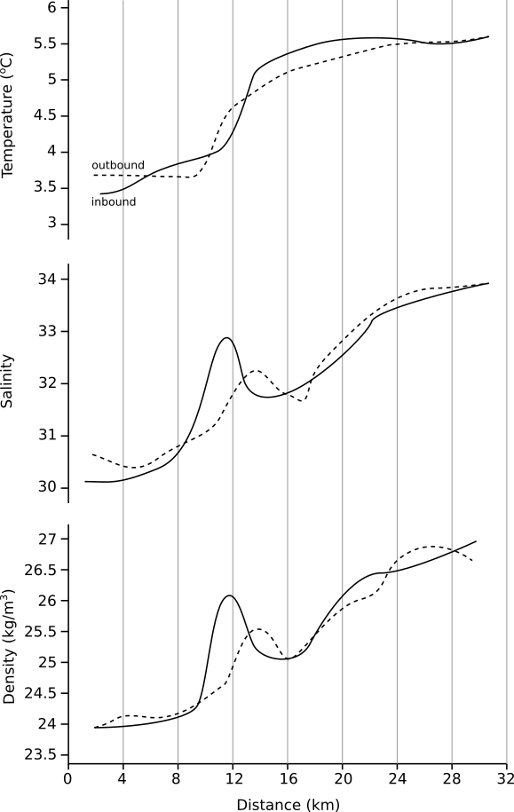

We are now going to apply what you have read in [Level 1](../level-1) to a graphic of your choosing. Remember, some of this is scientifically objective, but much of it comes down to personal preference and established best practices. There are no right and wrong answers, but you should be prepared to explain your reasoning and be respectful of other people's opinions.

## Example Redesign

We're going to be redesigning a figure from a paper. I'm going to give you an example from [this paper](https://agupubs.onlinelibrary.wiley.com/doi/full/10.1029/2001JC000935). It's a study of a coastal jet of freshwater flowing down the East Greenland coast. This figure we're going to be looking at is [Figure 2](https://agupubs.onlinelibrary.wiley.com/doi/full/10.1029/2001JC000935#jgrc8772-fig-0002), which is a horizontal transect of ocean surface temperature, salinity and density from the near coast, offshore for approximately 30 km.

There is a lot going on in this figure. They are trying to show three different variables taken at two different times (inbound and outbound transects). According to the text, the main take-aways from the figure are:

* There are two temperature regimes: ~4°C nearshore and ~5.5°C offshore with a thermal front around 14 km. 

* The salinity it fresh nearshore and saltier offshore, with a more complicated strucutre of high and low values inbetween.

* Density most closely mirrors salinity - salinity, not temperature is the driving factor in setting the ocean density in this region.

### Figure Analysis

I'm going to give my opinions in this figure here. First, let's discuss some of the effective techniques in this plot:

* The plot is designed in black and white making it accessible to people with colorblindness or who lack color printing equipment.

* The panel is not cluttered with lots of grid lines.

* The legend is clear with regards to what each line should be which.

* The font is appropriately sized and very easy to read.

Now, lets discuss some of the limitations:

* The distinction between the light and dark lines which denote the inbound and outbound transects is not distinct (or requires a good amount of work to determine),

* The author has chosen to put all three variables on one plotting panel leading to three independent y axes. You often see plots with two y axes, but this goes one further. One of the limitations on having two y axis is that you often have to create the same number of tick-marks on each axis for symmetry (and certainly if you want to use horizontal grid lines). In this case with three y axis, the left axis ticks are all double-labeled with both the density and temperature values they represent. This provides a barrier to simple interpretation.

* I think there's too much ink around the figure - I don't think we need the complete box around the panel nor do the intermediate ticks marks on the x-axis help locate where we are in distance when looking at the lines in the middle of the panel (in fact, I find it hard lining up the top and bottom x-axis tick marks because they are so closely spaced)

* The use of the different line types for each property works for much of the plot, but it gets confusing when they are in close proximity.

### Figure Redesign

The goal of this figure is to communicate how the different properties change and co-vary as you move away from the coast. Below is my redesigned figure.

Some of the changes I've made include:

* Moving each property to it's own y axis and stacking these vertically so you can read each more clearly

* Adding vertical light gray grid lines to guide the eye in interpretting the location of each feature in space and also comparing between properties.

* Made the inbound-outbound designation the solid-dashed line type which allows for easy of viewing (without having to add in colors) and comparing.

* Labeled the inbound-outbound designation directly on the figure

Some continuing limitations/questions of this figure:

* The vertical stacking allows for easier viewing, but does begin to make the figure quite long vertically. This might be hard to fit in a paper especially if we need to add more panels. There's a compromize to this method between the aspect ratio of the individual panels and the aspect ratio of the complete figure

* Perhaps a separate key for the inbound-outbound designation would be easier to interpret than labeling directing on the figure

## Exercise

It's time for you to give this a go and follow the above example.

You should:

* Find a figure in a paper that you have been reading that you think could use some improvements.

* Print this figure out on a sheet of paper and write on the same sheet: 
  * 1-2 sentances describing what the figure is trying to show.
  * A list of the design feature you like (so we don't get rid of the good as well as the bad).
  * A list of any design limitations of the figure.
  
* On a new sheet of paper you should then redesign the figure. Make a sketch of your improved design (rough is fine as long as the features you have improving are clearly shown) and then make a list of:
  * The ways you improved the figure.
  * The lingering questions/limitations you still have.

* Post these two pieces of paper next to each other in the classroom so we can have a chance to look at what each other have done. 

* Don't forget to fill out an exit ticket when you're done.
